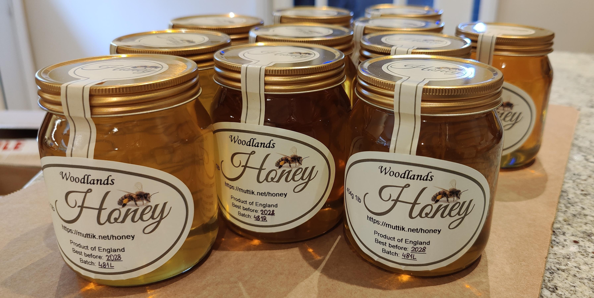
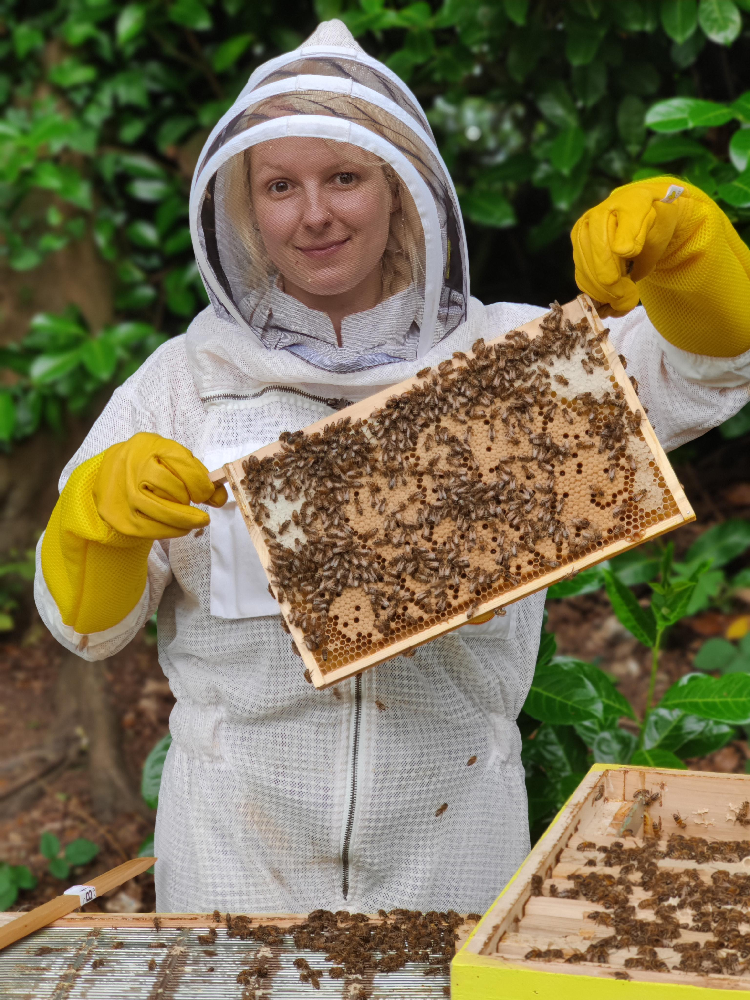
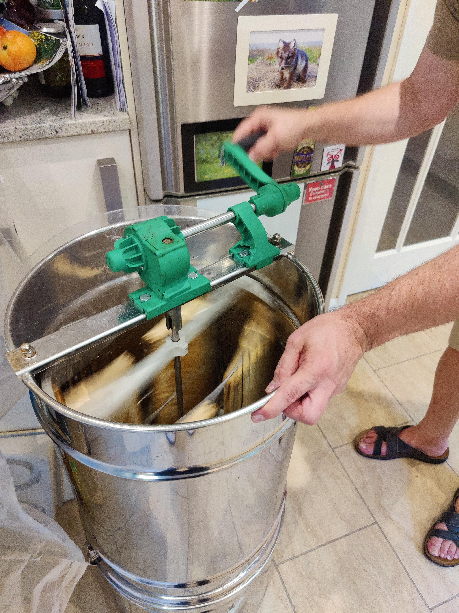
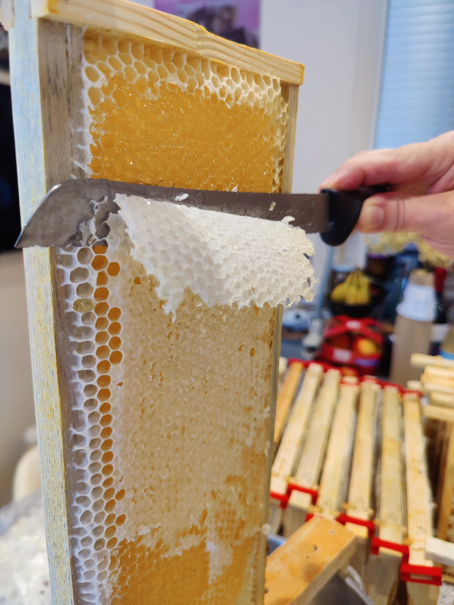

  <h1><strong>Woodlands Honey: award-winning pure raw unfiltered local product.</strong></h1>

Discover the magic in our honey – where every drop will teleport you to a flower meadow on a sunny summer day.
  
​At Woodlands Apiary, we are passionate about bringing you the finest honey straight from our hives in the heart of the countryside. As a small, family-run apiary,
we focus on ensuring that our bees are happy and our honey is as natural as possible.
 

---

<h2 style="text-align:center;"><strong>Our Award</strong></h2>

  
  

  The quality of our honey was confirmed in a competition held by mid-Bucks beekeepers association where it won the first place and was awarded "The Apiary Cup" in 2024. 
  

 

---

<h2 style="text-align:center;"><strong>Our Bees</strong></h2>

  

    Our small apiary is on the outskirts of Berkhamsted. Our hives are colonies of friendly and resourceful Buckfast bees which forage on the lush, 
    diverse flowers of Chiltern Hills, resulting in super tasty honey that captures the essence of the British countryside. You'll taste the difference in every drop. 
  

  

 

---

<h2 style="text-align:center;"><strong>Honey Crystallises</strong></h2>

  
  

    All pure honey will crystallise! In fact, crystallisation is a great indicator of honey quality. 
    A good idea to delay crystallisation is to keep honey in a fridge or cellar and take a jar out some time before 
    opening it.  To return crystallised honey to its liquid state place the honey jar into a bowl with warm water.
  

 

---
  
<h2 style="text-align:center;"><strong>Honey Extraction</strong></h2>

  

    Our commitment to quality of Woodlands Honey goes beyond the hives and bees. We practice the time-honoured craft of manual honey extraction, ensuring that every
    jar retains the purest flavours and nutrients. We carefully hand-spin the honeycombs and the honey only goes through a fine sieve to remove small pieces of honeycomb.
    There is no blending or heating involved. This process preserves the natural goodness that factory processing can never keep. Hands-on extraction allows us to make
    raw honey that is as close to nature as possible, with every batch reflecting our love and care. 
  

  

 

---

<h2 style="text-align:center;"><strong>Age Restriction</strong></h2>

  
  

    <strong>You should not give honey to babies under 12 months of age.​​</strong>
  

---

<h2 style="text-align: center;"><strong>Contact Us</strong></h2>
**Address**: Woodlands, Kingsdale Road, Berkhamsted, HP4 3BS, UK 
**Email**: honey@muttik.net
